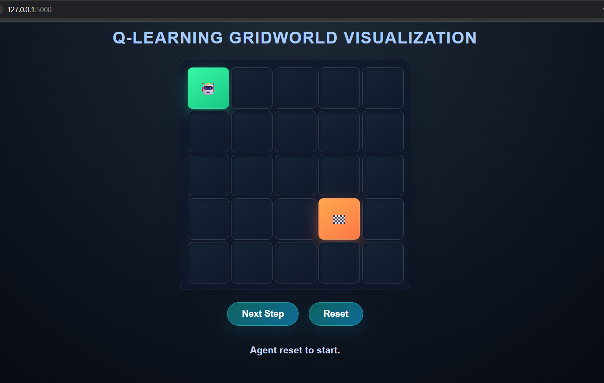

## GridQuest: Q-Learning Agent

A Reinforcement Learning project where an agent learns to navigate a 5x5 grid world using Q-learning. The agent starts from the top-left corner and aims to reach a specified goal position while maximizing cumulative rewards. The agent learns an optimal policy through trial and error by interacting with the environment, receiving positive rewards for reaching the goal and penalties for invalid or inefficient moves. The trained Q-table can be saved, loaded, and used for visualization or further testing.

### How it looks like:

## Technologies Used:

* Python - Main programming language
* NumPy - For efficient numerical operations and Q-table management
* Flask - To create a web interface for visualizing the agent's movement
* HTML, CSS - For UI

